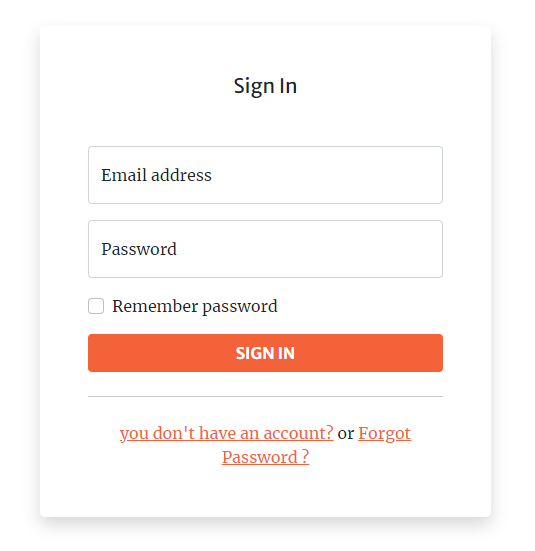

# Architecture de "Project name"

## Organisation des packages

## Descriptions des classes principales

décrire une classe = son rôle, ses attributs, ses méthodes publiques (une sorte de javadoc simplifié)

## Architecture back-end

des jolis schémas 

## Architecture de la BDD

des jolis schémas

## Architecture du front-end
   ### Connexion et Inscription
| La vue de connexion permettant de se connecter mais aussi de sauvegarder la session.De plus un lien y est pour se rendre à l'inscription, mais aussi un lien pour renitialiser le mot de passe si necessaire | La vue d'inscription permettant de s'inscrire en tant que nouveau degustateur, mais aussi un lien pour se connecter si on a deja un compte |
| ------ | ------ |
|  |  |
  #### Renitialiser le mot de passe

