# Architecture de "Project name"

## Organisation des packages

## Descriptions des classes principales

décrire une classe = son rôle, ses attributs, ses méthodes publiques (une sorte de javadoc simplifié)

## Architecture back-end

des jolis schémas

## Architecture de la BDD

| 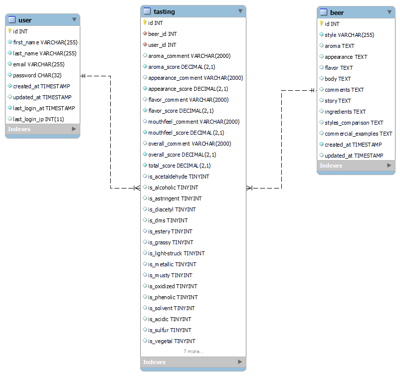

## Architecture du front-end

### Connexion et Inscription

| La vue de connexion permettant de se connecter mais aussi de sauvegarder la session. De plus un lien y est pour se rendre à l'inscription, mais aussi un lien pour renitialiser le mot de passe si necessaire | La vue d'inscription permettant de s'inscrire en tant que nouveau degustateur, mais aussi un lien pour se connecter si on a deja un compte |
| ------------------------------------------------------------------------------------------------------------------------------------------------------------------------------------------------------------- | ------------------------------------------------------------------------------------------------------------------------------------------ |
|                                                                                                                                           | 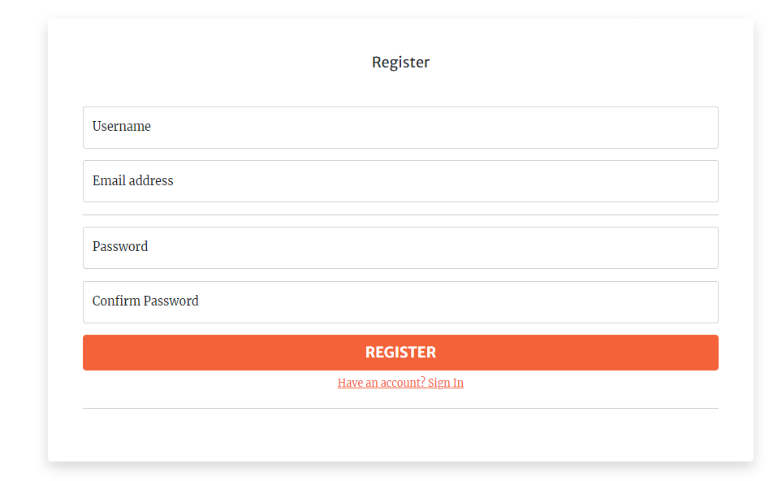                                                              |

#### Renitialiser le mot de passe

| Cette vue permet de verifier grace à l'email que l'utilisateur souhaitant renitialiser son de mot de passe, possède un compte.Si oui le ramener vers la page permettant de renitialiser ce mot de passe. | Cette vue permet de renitialiser le mot de passe.                                          |
| -------------------------------------------------------------------------------------------------------------------------------------------------------------------------------------------------------- | ------------------------------------------------------------------------------------------ |
| 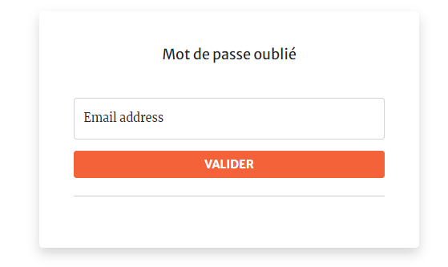                                                                                                                   | 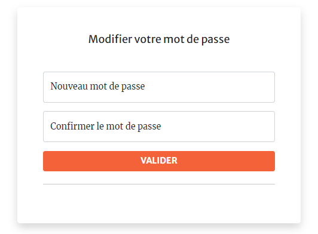 |

### Page d'accueil et Page des dégustations

| Cette vue présente l'interface accessible une fois l'utilisateur connecté. L'utilisateur peut ainsi voir ses anciennes dégustations, voir les nouvelles dégustations du site, créer de nouvelles dégustations et il peut se déconnecter. | Cette vue présente une liste de dégustation à l'utilisateur. Si l'utilisateur souhaite en savoir plus sur la dégustation, alors il lui suffira de cliquer sur le bouton "SHOW". |
| ---------------------------------------------------------------------------------------------------------------------------------------------------------------------------------------------------------------------------------------- | ------------------------------------------------------------------------------------------------------------------------------------------------------------------------------- |
| 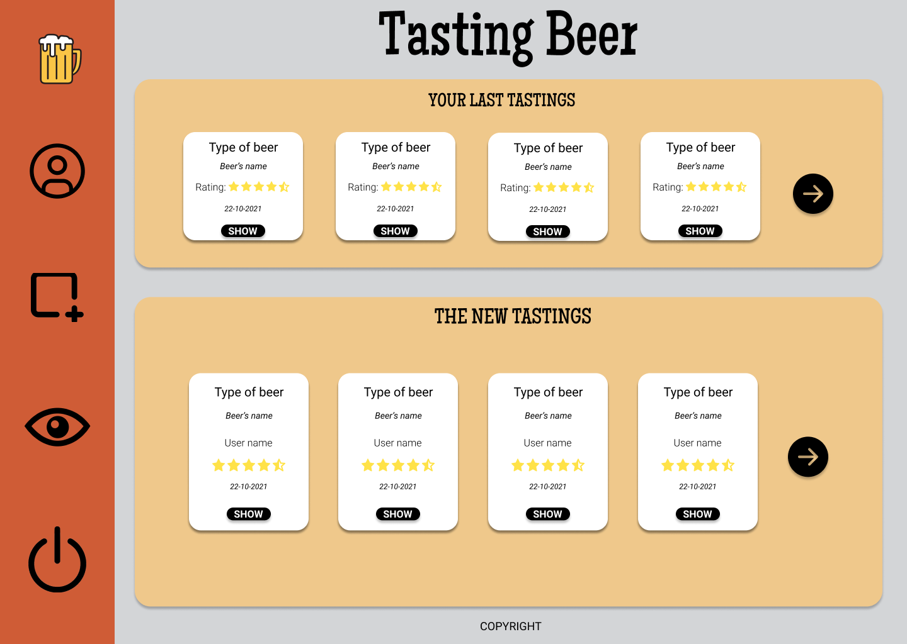                                                                                                                                                                   | 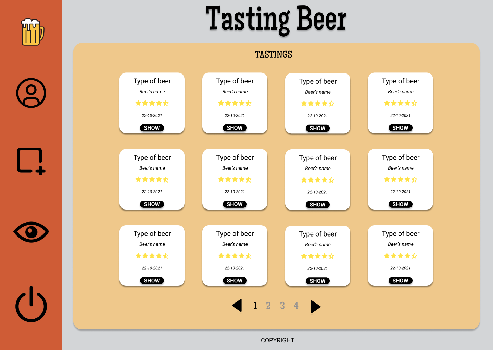                                                                                              |

### Formulaire de dégustation

| Cette vue permet à l'utilisateur de commencer à rentrer des informations sur sa nouvelle dégustation. Il commencera par entrer un nom pour sa dégustation, le nom de la bière et sa catégorie. Ensuite il devra cliquer sur la flèche pour continuer. | Cette vue est permet à l'utilisateur d'indiquer ce qu'il a remarqué concernant la bouteille. L'utilisateur peut soit retourner sur l'ancienne page pour corriger des erreurs, soit passer à la page suivante en cliquant sur la flèche adéquate. |
| ----------------------------------------------------------------------------------------------------------------------------------------------------------------------------------------------------------------------------------------------------- | ------------------------------------------------------------------------------------------------------------------------------------------------------------------------------------------------------------------------------------------------ |
| 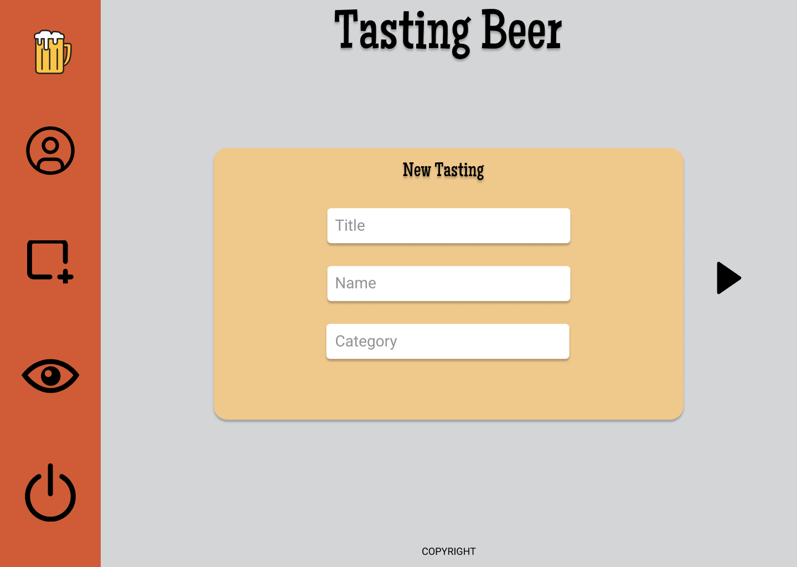                                                                                                                                                                      | 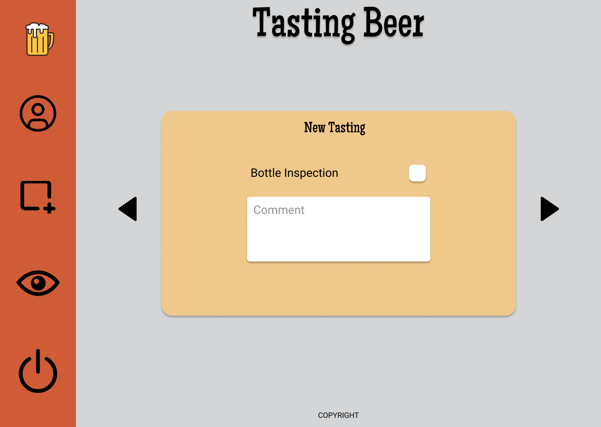                                                                                                                                                              |

### Formulaire de dégustation

| Cette vue permet à l'utilisateur de rentrer les informations qu'il souhaite donner concernant la dégustation. | Cette vue est permet à l'utilisateur d'indiquer les faux-goût qu'il aurait trouvé pendant la dégustation. |
| ------------------------------------------------------------------------------------------------------------- | --------------------------------------------------------------------------------------------------------- |
| 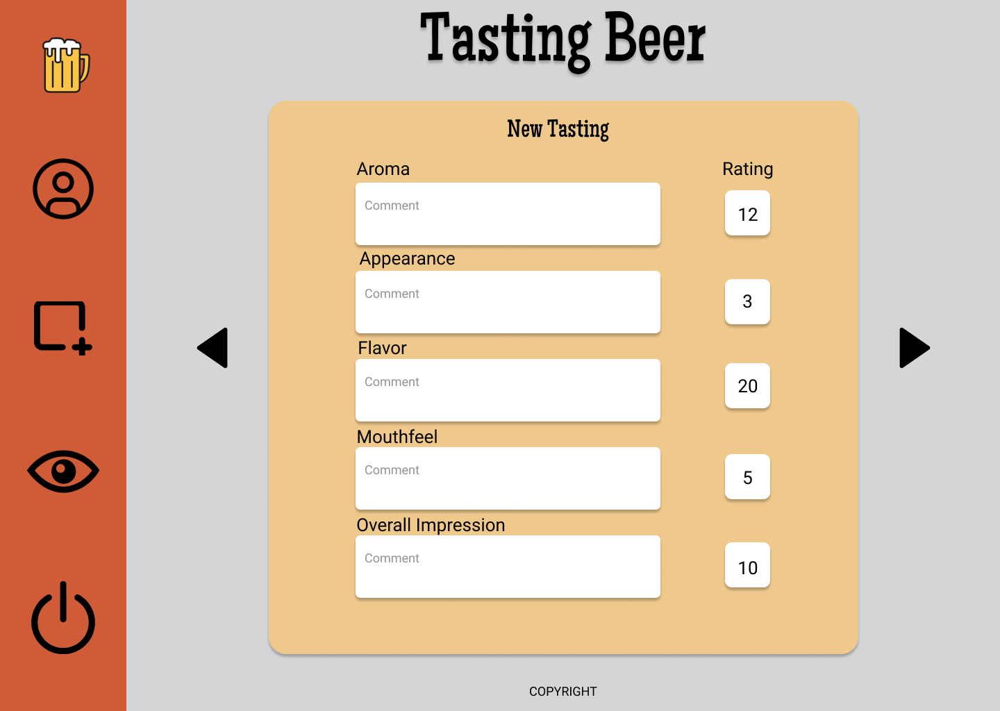                              | 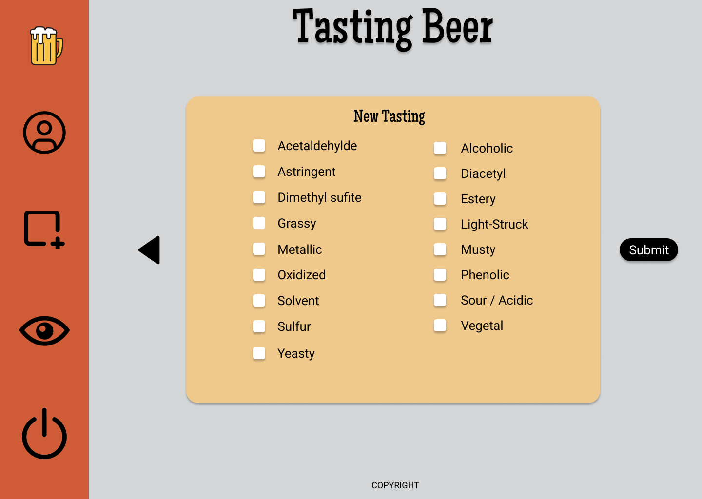                       |

### Formulaire de dégustation

| Cette vue indique à l'utilisateur que sa dégustation a bien été enregistrée.     |
| -------------------------------------------------------------------------------- |
| 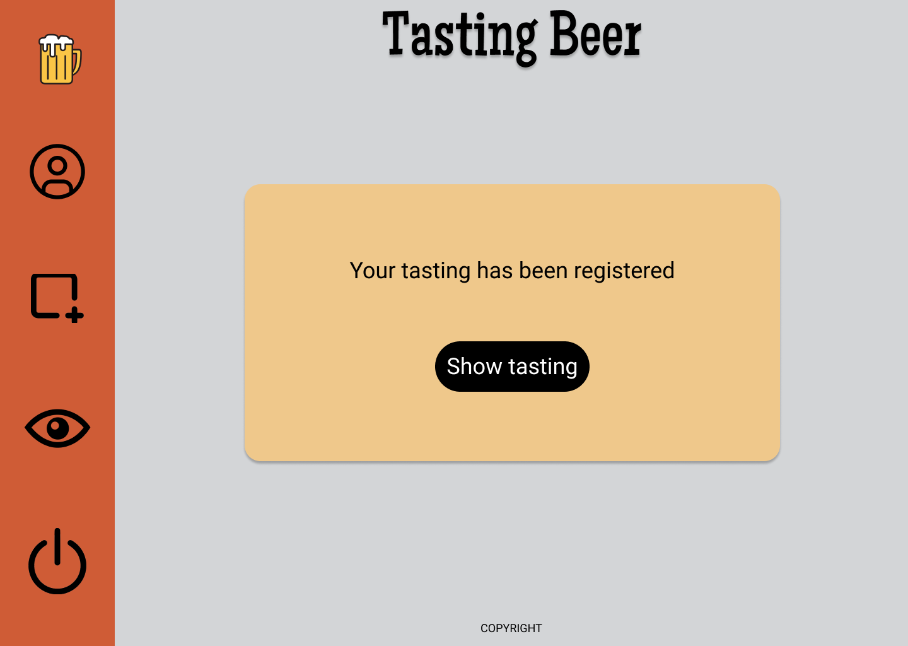 |
|                                                                                  |
